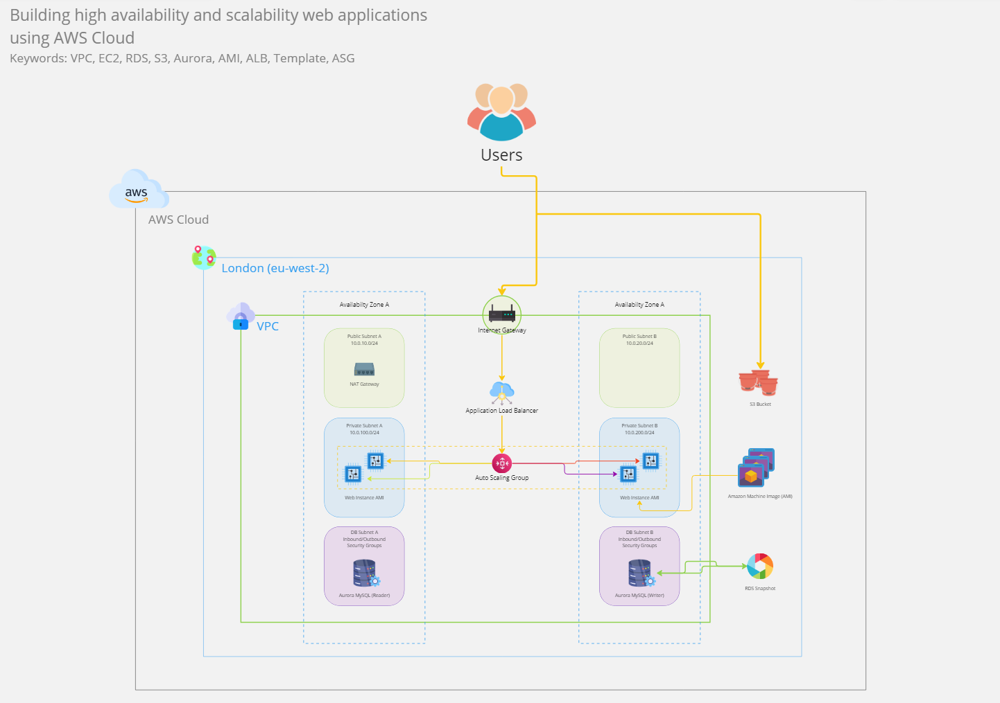

# Scalable Infrastructure using AWS Cloud

Link to [diagram](https://miro.com/app/board/uXjVNhM6xNM=/?share_link_id=567410157721)

## Summary

The diagram illustrates an architectural blueprint for building scalable web applications across multiple availability zones, leveraging core AWS services for optimal performance and cost-efficiency. The core components include Amazon <b>VPC</b>, <b>EC2</b>, <b>Aurora (RDS)</b> and <b>S3</b>.   
<b>Amazon VPC (Virtual Private Cloud)</b> for facilitating network segmentation, resource isolation and enhancing security through the utilization of public and private subnets.   
<b>EC2 (Elastic Compute Cloud)</b> offers vertically scalable computing resources on demand. This is further complemented by the integration of <b>ALB (Application Load Balancing)</b> and <b>ASG (Auto Scaling Group)</b>, providing control and configurations for horizontal scaling, enabling adjustments to varying workloads, ensuring high availability and fault tolerance.
  
<b>Aurora (RDS)</b> for a high-performance RDBMS, delivering redundancy, reliability, scalability and features such as backup & backtrack through RDS Snapshots.   
<b>S3 (Simple Storage Service)</b> serves as a simple and robust solution for storing various data types, including static web content, ensuring seamless integration and interconnectivity within applications.

